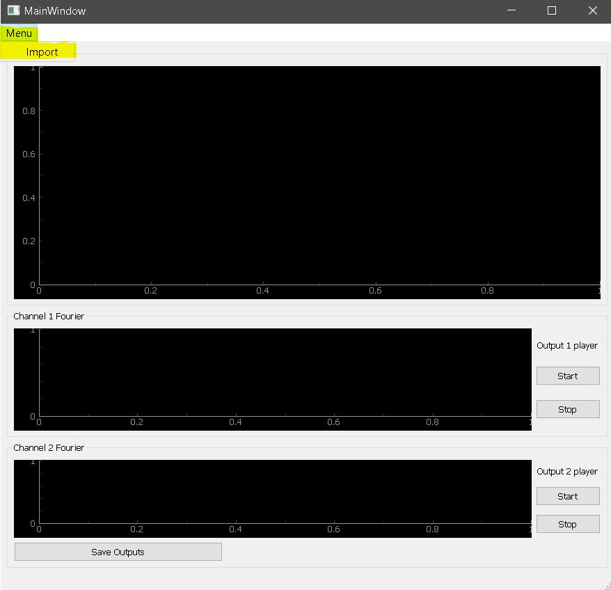
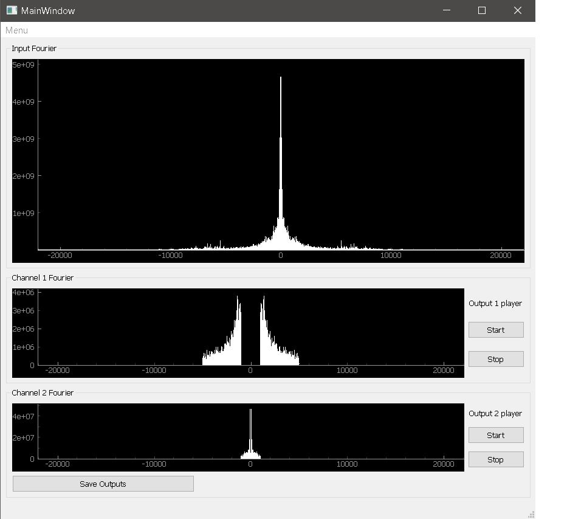
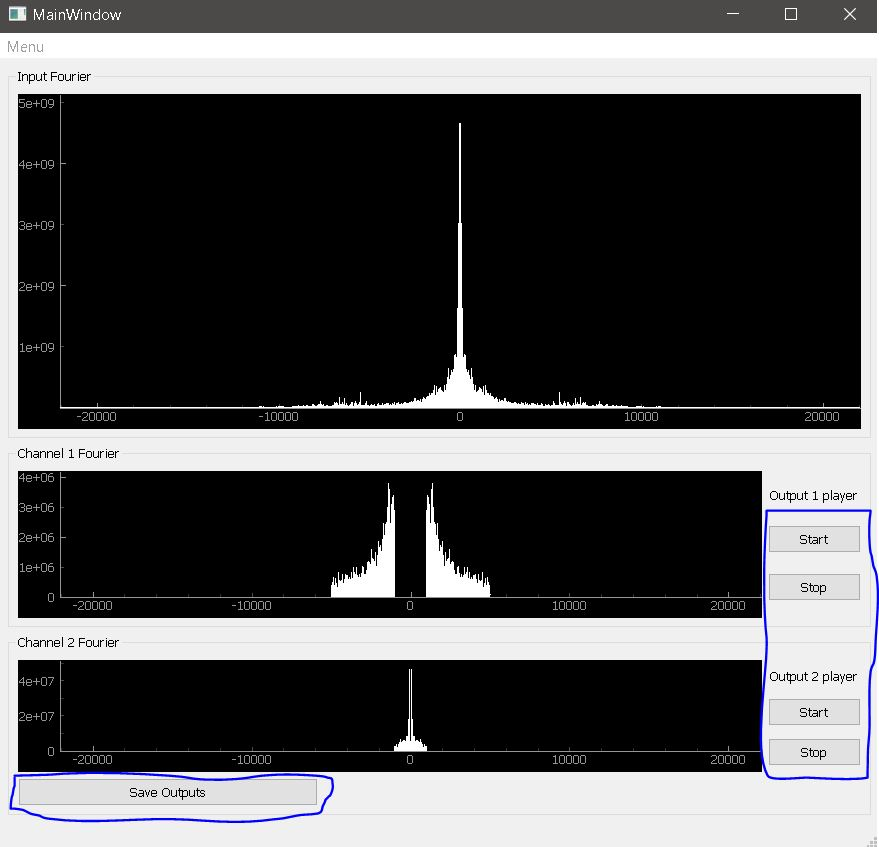
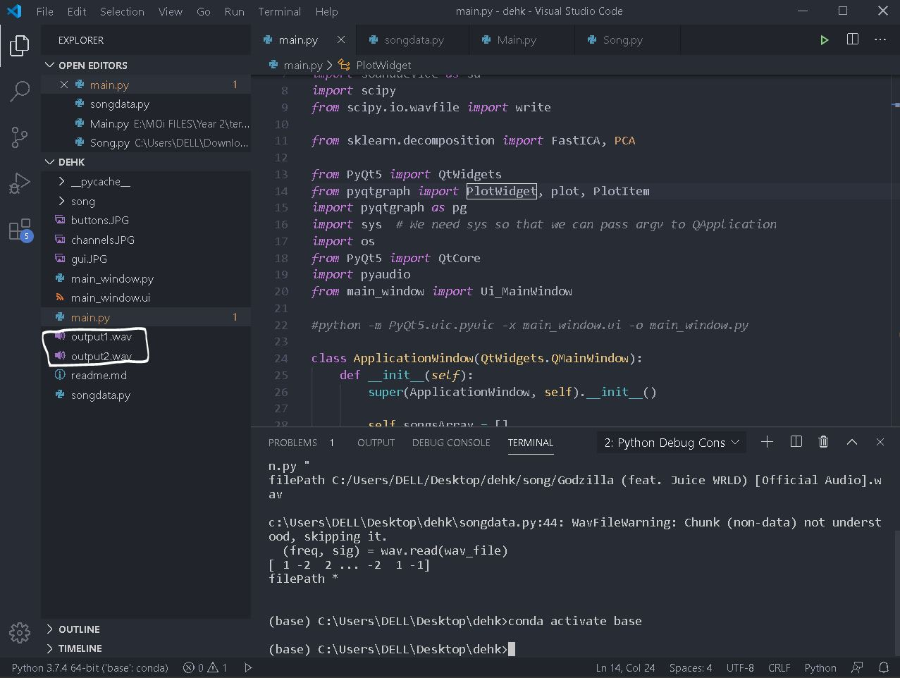

### This is a Vocals-music splitter gui made using PyQt5 and using sklearn FastICA Algorithm
-----------------

To start app, click on the menu button in the toolbar and click import. The song must be .wav, and both stereo and mono are acceptable.

-----------------

After the import, The input song fourier will be plotted along with the 2 psuedo channels created using fourier

-----------------
U can play or stop each output song individually using the play buttons, and save both outputs with the save button bellow

-----------------
The outputs will appear in the code folder like this.

